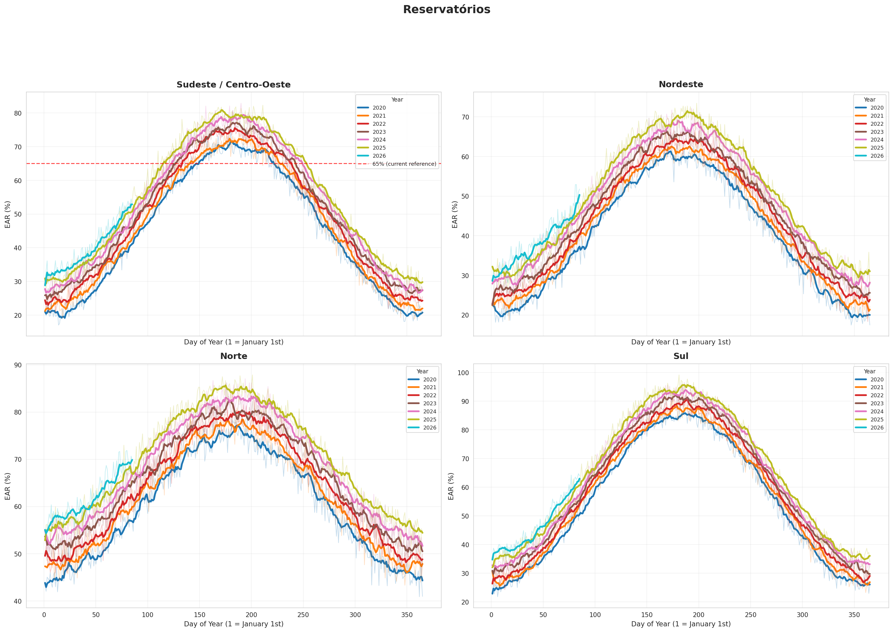
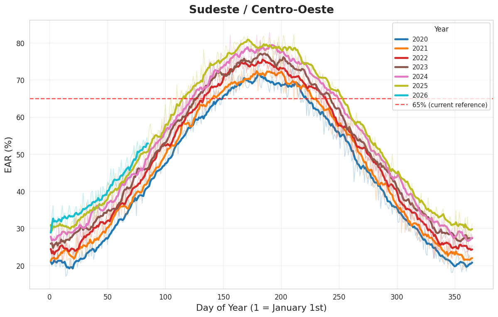
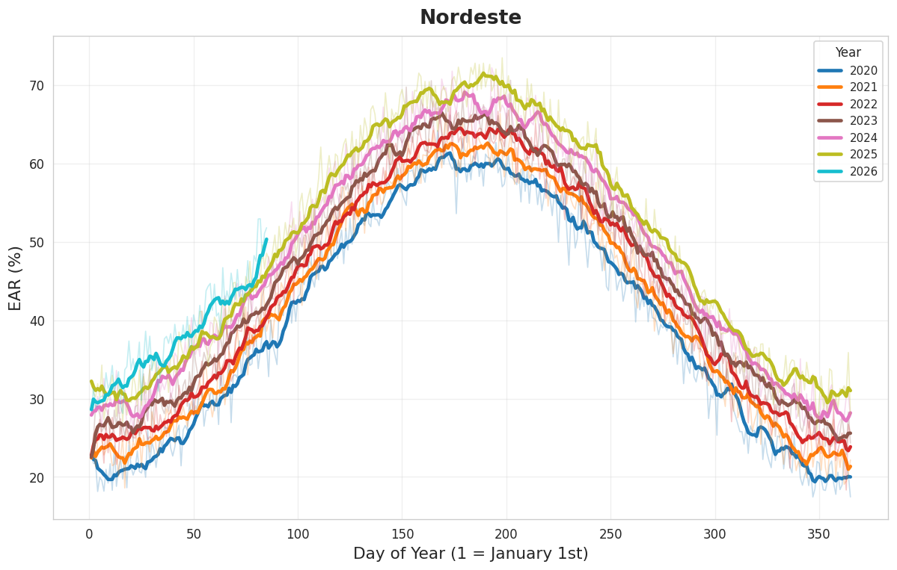
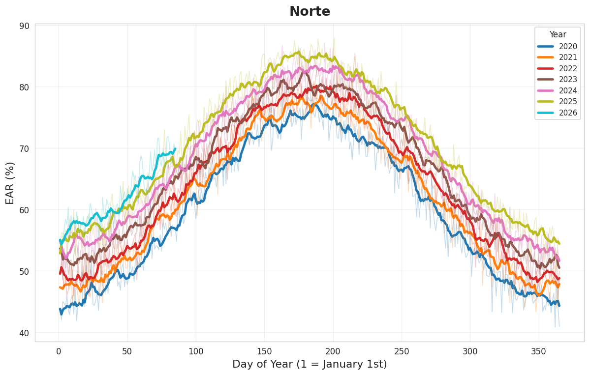
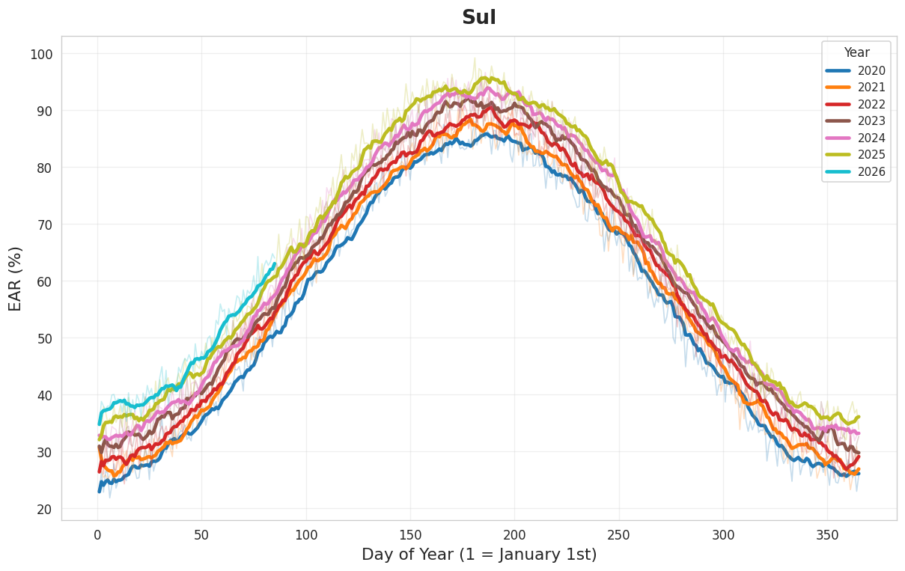

# Reservatórios Volume 🇧🇷💧

Visualize Brazilian hydroelectric reservoir storage levels (EAR — *Energia Armazenada*) by subsystem, comparing multiple years side-by-side.

Data is sourced from the [ONS (Operador Nacional do Sistema Elétrico)](https://dados.ons.org.br/dataset/ear-diario-por-subsistema) open-data portal.



---

## Features

- **Automatic download** of daily EAR data (Parquet format) from the ONS public S3 bucket.
- **Year-over-year comparison** — each year is plotted as a separate curve.
- **7-day moving average** overlay for smoother trend visualization.
- **2×2 grid** showing all four subsystems: *Sudeste/Centro-Oeste*, *Sul*, *Nordeste*, and *Norte*.
- **65 % reference line** for the Southeast/Central-West subsystem.
- **CLI options** to customize the year range and save the figure to a file.

---

## Quick Start

### Prerequisites

- Python 3.10 or newer
- Internet connection (to download data from ONS)

### Installation

```bash
# Clone the repository
git clone https://github.com/ppaulojr/Reservat-riosVolume.git
cd Reservat-riosVolume

# (Optional) Create a virtual environment
python -m venv .venv
source .venv/bin/activate   # Linux / macOS
# .venv\Scripts\activate    # Windows

# Install dependencies
pip install -r requirements.txt
```

### Running

```bash
# Default: download 2020–2026 and display the plot
python reservatorios_volume.py

# Custom year range
python reservatorios_volume.py --start-year 2022 --end-year 2026

# Save to a file instead of displaying
python reservatorios_volume.py --output reservatorios.png
```

---

## CLI Reference

| Argument | Default | Description |
|---|---|---|
| `--start-year` | `2020` | First year to download (inclusive) |
| `--end-year` | `2026` | Last year to download (inclusive) |
| `--output` | *(show window)* | Save figure to the given file path (e.g. `output.png`) |

---

## Screenshots

### Full 2×2 Overview


### Sudeste / Centro-Oeste



### Nordeste



### Norte



### Sul



---

## Project Structure

```
Reservat-riosVolume/
├── reservatorios_volume.py   # Main script
├── requirements.txt          # Python dependencies
├── screenshots/              # Sample output images
│   ├── reservatorios_2x2.png
│   ├── subsystem_Nordeste.png
│   ├── subsystem_Norte.png
│   ├── subsystem_Sudeste___Centro-Oeste.png
│   └── subsystem_Sul.png
├── docs/
│   └── DOCUMENTATION.md      # Detailed technical documentation
├── LICENSE                   # MIT License
└── README.md                 # This file
```

---

## Data Source

| Field | Description |
|---|---|
| **Dataset** | EAR Diário por Subsistema |
| **Provider** | ONS — Operador Nacional do Sistema Elétrico |
| **Portal** | <https://dados.ons.org.br/dataset/ear-diario-por-subsistema> |
| **Format** | Apache Parquet (one file per year) |
| **Key column** | `ear_verif_subsistema_percentual` — verified EAR as a percentage of maximum storage |

---

## License

This project is licensed under the **MIT License** — see the [LICENSE](LICENSE) file for details.
